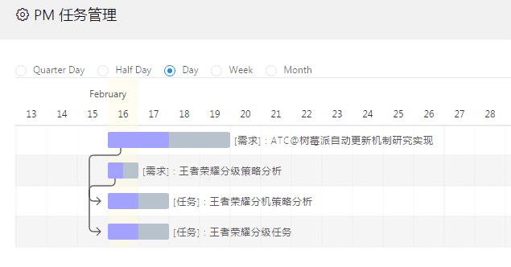

# gantt-for-react

> [Frappe Gantt](https://github.com/frappe/gantt) components for React wrapper.

[](https://travis-ci.org/hustcc/gantt-for-react)
[](https://www.npmjs.com/package/gantt-for-react)
[](https://www.npmjs.com/package/gantt-for-react)
[](https://www.npmjs.com/package/gantt-for-react)


# 1. Install

```sh
npm install --save gantt-for-react
```


# 2. Usage

Online demo see [https://git.hust.cc/gantt-for-react/](https://git.hust.cc/gantt-for-react/).

```jsx
import React from 'react';
import ReactGantt from 'gantt-for-react';

<ReactGantt
  tasks={this.getTasks()}
  viewMode={this.state.viewMode}
  onClick={this._func}
  onDateChange={this._func}
  onProgressChange={this._func}
  onViewChange={this._func}
  customPopupHtml={this._html_func}
/>
```

Or you can see the code [here](https://github.com/hustcc/gantt-for-react/blob/master/demo/GanttComponent.jsx#L51).


# 3. Component props

 - **`tasks`** (required, array)

The tasks array need to be show with gantt graph. task is an object with format: **{ id, name, start, end, progress, dependencies, custom_class }**.

 - **`viewMode`** (required, string)

The view mode of gantt. Can be **Quarter Day, Half Day, Day, Week, Month**.

 - **`customPopupHtml`** (optional, func)

The popo html function, can be a function that returns html or a simple html string.

And **4 event function props**: `onClick`, `onDateChange`, `onProgressChange`, `onViewChange`. Document can see [here](https://frappe.github.io/gantt/).


# 4. Screenshot




# 5. LICENSE

MIT @[hustcc](https://github.com/hustcc)
